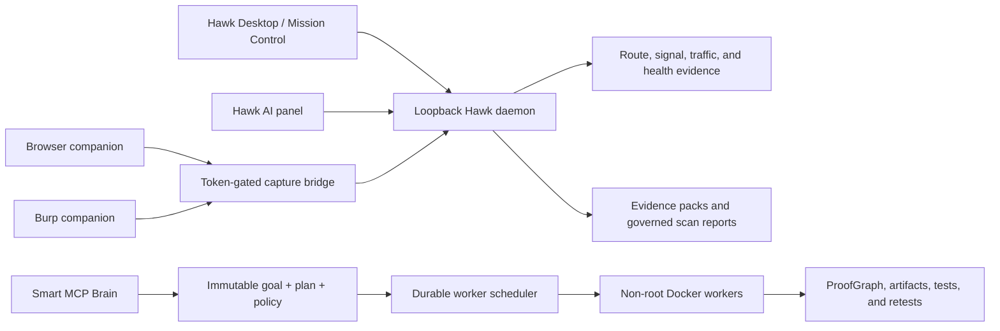

# Hawk Security IDE — Product and Architecture

Hawk is a branded, security-native desktop IDE built on Code-OSS. It combines
AI-assisted code changes, passive application-security analysis, live
Browser/Burp evidence, governed MCP plans, isolated Docker workers, and
portable security reporting in one local-first workspace.

The application name, executable, installer identity, protocol, theme, activity
bar, Mission Control, AI panel, desktop icons, and update channel are Hawk.
Third-party and upstream attribution is retained in `NOTICE` and the relevant
license files.

## Product surfaces

| Surface | Purpose | Safety boundary |
| --- | --- | --- |
| Hawk desktop | Branded Windows, macOS, and Linux Code-OSS application | Workspace trust and local control-plane token |
| Mission Control | Routes, signals, traffic, supply-chain posture, evidence, and MCP status | Signals are never auto-labelled as vulnerabilities |
| Hawk AI | Streaming tasks, context, plans, history, diff preview, tests, Apply/Reject/Revert | File changes remain review-gated |
| Browser companion | Redacted Fetch/XHR/WebSocket and webRequest metadata | Disabled by default; explicit regex scope and rate limit |
| Burp companion | Redacted proxy traffic sent to the local Hawk evidence plane | Burp scope by default; explicit pairing and bounded queue |
| Smart MCP Brain | Typed goals, capability DAGs, model routing, exact-plan approval, durable runs | Scope, actions, budgets, and SHA-256 plan hashes are immutable contracts |
| Docker worker mesh | Parallel isolated validation, patch, and regression lanes | Local image only, immutable image ID, non-root, no network by default, quotas |
| Evidence builder | Markdown, HTML, JSON, SARIF, and SHA-256 manifest | Sanitized local evidence; no request replay |

## System flow



All local HTTP services bind to loopback. Tokens are process-scoped and are not
sent into webviews. Capture companions receive a separate pairing token.

## Hawk AI

The native AI workspace includes:

- streamed assistant and tool events;
- active file, selection, open-tab, diagnostics, and Git-diff context;
- persistent task history and plan events;
- patch summary and full diff preview;
- detected test gates with explicit approval;
- Apply, Reject, Revert, Cancel, and Git refresh actions;
- workspace trust checks and bounded local state.

The AI worker does not receive an unrestricted security-testing authority.
Sensitive workflows are compiled separately into Smart MCP goals and plans.

## Governed security workflows

Hawk ships three scan templates:

1. `passive-workspace` maps routes and static signals entirely offline.
2. `runtime-observe` correlates bounded live Browser/Burp metadata to source
   routes without generating or replaying requests.
3. `release-gate` creates an offline pre-release posture snapshot from code,
   runtime evidence, and imported organization health.

Every scan requires explicit operator approval. The approval is bound to a
deterministic SHA-256 hash covering the workspace, scope, network policy, rate
limit, and checks.

The evidence builder writes:

- `report.md` for analyst review;
- `report.html` for portable presentation;
- `evidence.json` for automation;
- `findings.sarif` for code-scanning interoperability;
- `manifest.json` with SHA-256 hashes and byte sizes.

Reports live under `.hawk/reports/`. They contain redacted metadata and static
signals, not raw credential headers, cookies, or request/response bodies.

## Smart MCP Brain

Smart MCP provides:

- capability search instead of loading every schema into model context;
- typed goals with repositories, hosts, routes, identities, allowed actions,
  forbidden actions, cost, time, token, request-rate, and parallel budgets;
- deterministic DAG planning and risk-aware model routing;
- policy decisions of `allow`, `require-approval`, or `deny`;
- short-lived approval bound to the exact goal, plan ID, and plan hash;
- durable task events, leases, heartbeats, pause, resume, cancel, and recovery;
- an evidence-gated long-term memory;
- a ProofGraph connecting code, routes, requests, findings, patches, tests,
  tools, models, agents, and runs;
- an MCP Sentinel for prompt injection, tool poisoning, rug-pull changes,
  secret output, unsafe egress, and unsigned servers;
- local A2A envelopes and evaluation baselines.

Mission Control can create three Smart MCP-compatible planning profiles:
read-only review, remediation, and explicitly scoped authorized validation.
Creating a mission persists the goal, plan, policy, and readable DAG report; it
does not approve or execute the plan.

## Docker worker mesh

One run can contain up to 64 tasks and execute up to 32 independent workers.
Dependencies are scheduled as a DAG and failed dependencies skip downstream
work.

Worker controls include:

- no implicit image pull;
- local tag resolved to an immutable `sha256:` image identity before launch;
- read-only workspace mount and read-only root filesystem;
- non-root UID/GID;
- all Linux capabilities dropped and `no-new-privileges`;
- no container network by default;
- explicit approval for bridge networking or inherited environment values;
- CPU, RAM, PID, open-file, timeout, retry, and global multi-run ceilings;
- per-worker artifact tmpfs quota copied out only after completion;
- capped output, per-task artifact directories, cancellation, and forced cleanup;
- durable snapshots, restart reattachment, and workspace-scoped orphan cleanup.

Docker Desktop start and stop are explicit MCP actions. Stopping refuses while
Hawk runs are active unless the operator explicitly forces cancellation and
acknowledges that unrelated containers can be affected.

## Desktop and release engineering

`desktop/upstream.json` pins the Code-OSS source commit and Node.js version.
`desktop/prepare-code-oss.mjs` creates a separate branded source tree and
injects the built-in Hawk extension and generated assets.

The release workflow builds:

- Windows x64 portable ZIP, EXE installer, and MSI;
- Linux x64 tarball, deb, and AppImage;
- macOS x64 and arm64 ZIP and DMG;
- Browser companion ZIP and Burp companion JAR;
- SHA-256 checksums and a native update manifest.

Signing and notarization are enabled only when deployment secrets exist.
Unsigned dry runs remain useful for verifying reproducible packaging. The
private update worker translates Code-OSS update checks into private GitHub
Release assets without exposing the repository token to desktop clients.

Published Stable/Beta artifacts are fail-closed: Windows signing, Apple
signing/notarization, the update origin, and production legal metadata are all
mandatory. Unsigned dry runs remain available but cannot create an official
GitHub Release.

## Hawk Cloud and commercial control plane

`deploy/control-plane` is a Cloudflare Worker backed by D1. It implements
GitHub identity, organizations, RBAC, invitations, cloud preference sync,
Stripe Checkout/Portal/webhooks, plan entitlements, seats, short-lived
device-bound license grants, audit logs, and opt-in telemetry. The desktop
extension stores its cloud session in SecretStorage and exposes account, team,
workspace, sync, upgrade, and billing commands.

Cloud workspace state accepts only bounded Hawk preferences. Provider keys,
source code, prompts, responses, evidence, captures, findings, and tool output
stay outside the service.

The production automation also includes:

- Cloudflare control-plane and update-service deployment workflows;
- Stable and Beta native update routing;
- scheduled health monitoring and incident issue creation;
- CodeQL and high-severity production dependency auditing;
- Chrome Web Store API v2 upload/review submission;
- PortSwigger BApp Store review submission from a public companion source;
- a real-user Beta program, independent pentest scope, threat model, privacy,
  terms, EULA, responsible-use, and security-disclosure documents.

## Important local paths

| Path | Contents |
| --- | --- |
| `.hawk/health.json` | Sanitized imported organization posture |
| `.hawk/reports/` | Scan reports and portable evidence packs |
| `.hawk/plans/` | Human-readable governed mission plans |
| `.hawk/brain/` | Goals, plans, policies, approvals, memory, and run state |
| `.hawk/orchestrations/` | Durable Docker run snapshots and task artifacts |
| `.hawk/ai-sessions/` | Native AI task history, events, patches, and state |

These runtime paths should be treated as engagement data. Do not commit them to
source control.

## Development verification

The canonical local gate is:

```text
npm run ci
```

It runs strict TypeScript checks, Biome, Vitest, the core build, extension
type-check/build, and Browser integration validation. GitHub CI additionally
compiles the Java Burp companion. The desktop release workflow performs a
cross-platform dry run before a production tag should be published.

## Security and legal scope

Hawk is for systems the operator owns or is explicitly authorized to assess.
Static signals require validation, active work requires declared scope, and
credentials are never an implicit capability. See `AUDIT.md` for the historical
code audit and `NOTICE` for upstream attribution.
