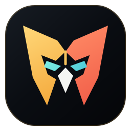
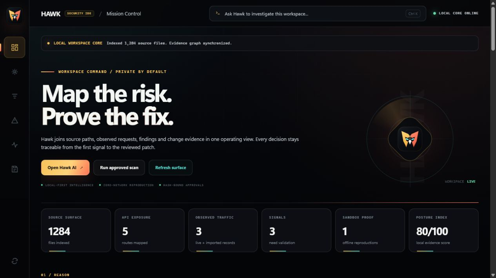
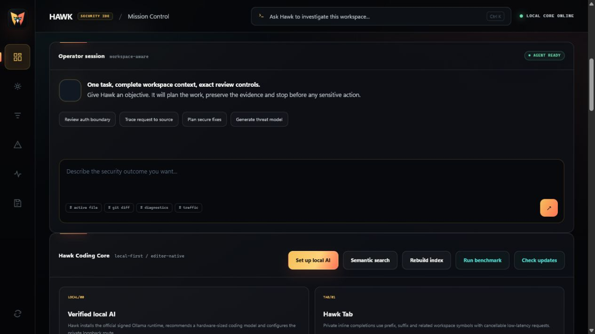
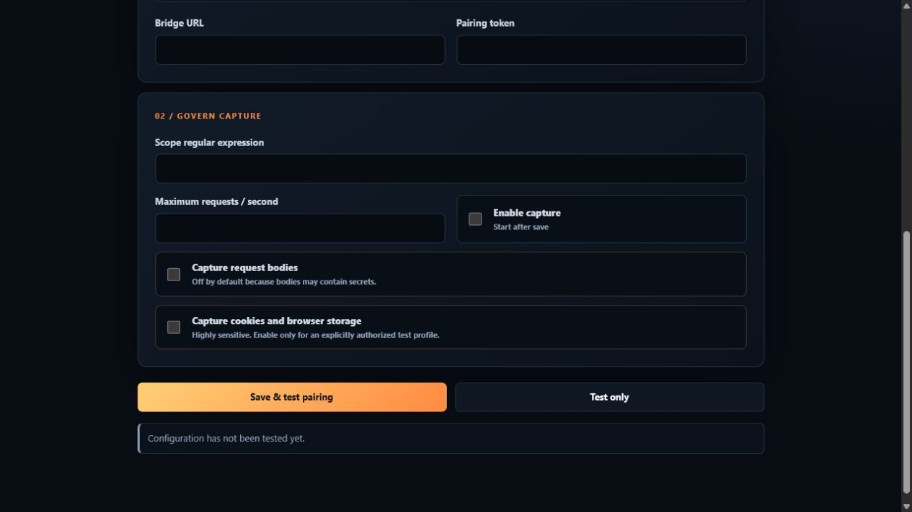
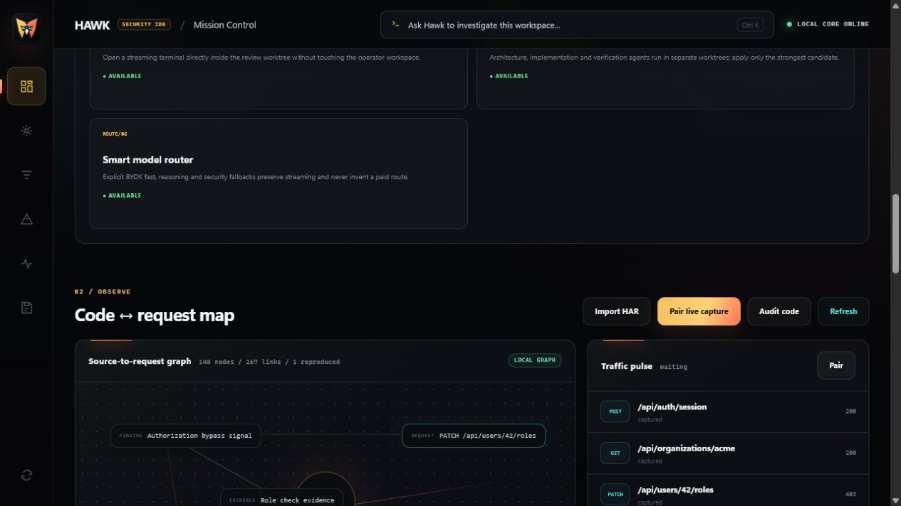
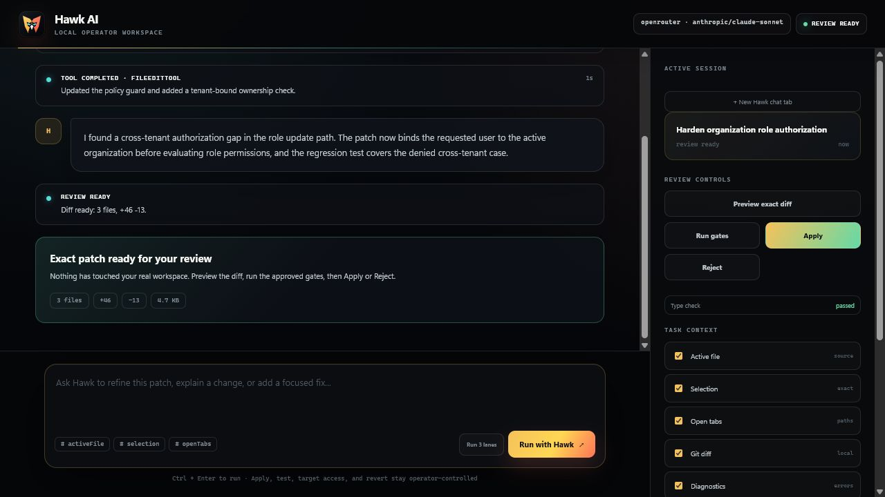
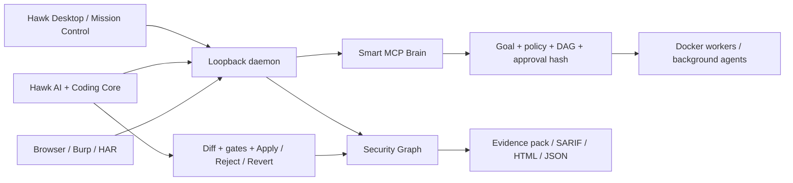

<h1 align="center">Hawk Security IDE</h1>

<p align="center">
  
</p>

<p align="center"><strong>Map the risk. Prove the fix.</strong><br />
The local-first security IDE for code, runtime evidence, governed AI, and reviewable change.</p>

<p align="center">
  <a href="https://github.com/MrBoodj011/hawk/actions"></a>
  <a href="https://github.com/MrBoodj011/hawk/releases"></a>
  <a href="LICENSE"></a>
  <a href="https://github.com/MrBoodj011/hawk"></a>
</p>

<p align="center">
  <a href="#why-hawk">Why Hawk</a> ·
  <a href="#product-surfaces">Product surfaces</a> ·
  <a href="#quick-start">Quick start</a> ·
  <a href="#security-model">Security model</a> ·
  <a href="docs/architecture.md">Architecture</a> ·
  <a href="output/pdf/Hawk_Guide_Complet_Projet.pdf">Complete project guide</a>
</p>



> Hawk is a branded Code-OSS workspace that keeps the operator in control. It connects source code, observed traffic, findings, evidence, AI-generated patches, tests, and retests in one local operating surface.

<p align="center">
  <a href="output/pdf/Hawk_Guide_Complet_Projet.pdf"><strong>Download the complete Hawk project guide (PDF)</strong></a>
</p>

### Project identity

| Field | Value |
| --- | --- |
| Product | **Hawk Security IDE** |
| Author and maintainer | **[MrBoodj011](https://github.com/MrBoodj011)** |
| Repository | [github.com/MrBoodj011/hawk](https://github.com/MrBoodj011/hawk) |
| Current version | `0.7.0` |
| Package name | `@hawk/ide` |
| License | [Apache-2.0](LICENSE) |
| Operating model | Personal, local-first, operator-controlled |

Hawk is developed and published by **MrBoodj011**. The repository contains the IDE source, native AI runtime, daemon, MCP server, extensions, Docker workers, release tooling, documentation, and the complete project guide.

## Why Hawk

Hawk is built around one auditable loop:

```text
Understand code -> observe authorized traffic -> test a signal -> collect proof -> fix -> test -> retest
```

The product is intentionally local-first and review-controlled:

| Principle | What it means in practice |
| --- | --- |
| **Local by default** | Source, sessions, evidence, credentials, and model configuration stay on the operator machine. |
| **Approval-gated** | Sensitive scans, network access, replays, Docker missions, tests, Apply, and Revert require explicit decisions. |
| **Proof before verdict** | A static signal is not a vulnerability. Identity, impact, scope, side effects, redaction, and evidence gates remain separate. |
| **Recoverable** | Long AI tasks, Docker workers, leases, checkpoints, and orchestration state survive interruption and restart. |
| **Inspectable** | Plans, hashes, tool calls, diffs, test gates, artifacts, and provenance are visible instead of hidden behind a chat box. |

## Product surfaces

### Mission Control

An operational dashboard for source surface, API exposure, live and imported traffic, signals, sandbox proof, posture, the Security Graph, and governed actions.

### Hawk AI

An in-editor engineering room with streaming responses, plans, tool events, task history, file/tab/git/diagnostics context, exact diff preview, checkpoints, Apply / Reject / Revert, test gates, and pause/resume recovery.



### Hawk Coding Core

- Hawk Tab and bounded multiline Next Edit prediction.
- Persistent incremental semantic index with TypeScript/JavaScript AST and language-aware symbols for Python, Java, Kotlin, C#, Go, and Rust.
- Optional loopback-only Ollama embeddings and lexical fallback.
- Model router with local Ollama, LM Studio, and explicit BYOK providers.
- Debug Agent for DAP snapshots and bounded diagnose -> edit -> approved test -> fix loops.
- AST-aware semantic merge for parallel worktrees.
- Local latency, model-evaluation, and memory benchmarks.

### Security workflow

- Passive route indexing for Express, Fastify, and common Next.js API layouts.
- Passive rules for embedded credentials, disabled TLS verification, `eval`, interpolated SQL-looking calls, and risky CORS combinations.
- Deterministic offline reproduction in Docker with baseline, negative-control, and reproduction gates.
- Findings triage with source navigation, reproduction, retest, evidence packs, and proof history.
- Security Graph linking repositories, files, symbols, routes, requests, identities, findings, patches, tests, runs, and artifacts.

### Browser and Burp companions

Capture is disabled by default and stays bounded by pairing, URL scope, request rate, redaction, and queue limits.



Governed identity replay is available for an explicitly approved captured request:

- exact host-and-port binding;
- 2-8 named credential sets;
- 0.1-5 requests per second;
- no redirects;
- bounded request and response fingerprints;
- credentials and bodies held in memory only;
- response differences are leads for review, never automatic authorization findings.

### The operating surface

<p align="center">
  
  
</p>

<p align="center"><sub>Security Graph correlation on the left. Review-gated AI change control on the right.</sub></p>

### Smart MCP Brain

Hawk includes a typed MCP control plane for goals, scope, capability discovery, policies, DAG plans, model routing, approvals, durable runs, worker leases, memory, Sentinel checks, structured artifacts, and native MCP Tasks.

The MCP App is sandboxed and zero-egress by default. The MCP server exposes local resources, prompts, typed tools, risk annotations, and live event notifications without turning the IDE into an unbounded agent shell.

### Distributed Docker workers

Long jobs can fan out across up to 32 bounded worker instances with dependency-aware scheduling, critical-path scoring, leases, retry reassignment, resource governance, checkpoints, and restart recovery.

| Network mode | Guardrail |
| --- | --- |
| `none` | Default. No worker network. |
| `restricted` | Authenticated Hawk egress proxy with exact host and port allowlists. |
| `bridge` | Legacy input only. Hawk normalizes it to `restricted`; an old persisted run is migrated to `none` until the operator approves a new restricted-egress policy. |

## What each part does

| Part | Responsibility | Typical operator action |
| --- | --- | --- |
| **Code-OSS desktop** | Branded editor, terminal, Git, debug host, extension host, and Hawk activity bar. | Open a trusted workspace and launch Mission Control. |
| **Mission Control** | Operational view of code, routes, traffic, findings, proof, posture, and governed actions. | Index a workspace, inspect the Security Graph, or plan a scan. |
| **Hawk AI** | Workspace-aware agent with streaming, context selection, plans, tool events, diff review, tests, and task history. | Ask for a bounded change, review the diff, run gates, then Apply or Reject. |
| **Coding Core** | Hawk Tab, Next Edit, semantic index, search, model evaluation, debugger loop, and AST merge. | Predict an edit, search symbols, or recover a stopped debug task. |
| **Traffic plane** | HAR import, Browser Companion, Burp Companion, timeline, source correlation, and identity replay. | Pair a local capture, import redacted traffic, or replay an approved request. |
| **Security workflow** | Passive rules, findings, Docker reproduction, nine verification gates, retest, and evidence builder. | Turn a signal into a reviewable, reproducible evidence pack. |
| **Smart MCP Brain** | Goals, policies, capability search, DAGs, approvals, memory, Sentinel, A2A, and artifacts. | Plan a mission before any sensitive tool is allowed to execute. |
| **Worker mesh** | Bounded Docker agents, scheduling, leases, retries, checkpoints, and recovery. | Split a long task across isolated workers and inspect each artifact. |

### End-to-end example

```text
1. Index the repository and map routes/symbols.
2. Import a redacted HAR or pair Browser/Burp for authorized runtime context.
3. Hawk links request -> route -> source -> signal in the Security Graph.
4. The operator plans a passive scan or a supported offline reproduction.
5. Hawk shows the exact policy, limits, plan hash, and approval dialog.
6. Docker runs baseline, negative-control, and reproduction gates offline.
7. Hawk AI prepares a minimal patch in an isolated worktree.
8. The operator reviews the exact diff and runs approved gates.
9. Apply, Reject, or Revert is decided by the operator, never by the model alone.
10. Retest and export Markdown, HTML, JSON, SARIF, and SHA-256 evidence.
```

## Architecture at a glance



The daemon binds to loopback and requires a random process-scoped token. The extension, MCP bridge, and companions use separate short-lived credentials and explicit pairing.

## Quick start

### Requirements

- Node.js 20+ and npm.
- Git.
- Docker Desktop for sandbox reproduction or worker orchestration.
- Optional: Ollama for private local models.
- Optional: Java 21 for the Burp companion.

### Build the workspace and extension

```sh
npm install
npm run build
npm run check:extension
npm run build:extension
```

Open `extensions/hawk-security-ide` in a Code-OSS extension development host, then open the Hawk activity-bar icon. `Ctrl+Shift+H` opens Mission Control and `Alt+\\` requests Hawk Tab / Next Edit.

### Start the local daemon

```sh
npm run dev:ide-daemon -- --workspace /path/to/project
```

The command prints a loopback URL and process-scoped token:

```sh
curl -H "X-Hawk-Token: <token>" http://127.0.0.1:<port>/v1/health
curl -X POST -H "X-Hawk-Token: <token>" http://127.0.0.1:<port>/v1/workspace/index
```

### Optional local AI

Use **Hawk: Set Up Local AI with Ollama** from the command palette. The wizard verifies the official installer digest and Windows signer, recommends a model for available RAM, asks for approval before download, and configures the loopback provider.

### Build the restricted egress proxy

```sh
npm run docker:build-egress-proxy
```

The proxy is used only by workers whose plan explicitly selects `network_mode: restricted` and supplies an allowlist.

### Start the MCP server

The **Copy MCP config** command copies a local-only configuration:

```json
{
  "mcpServers": {
    "hawk": {
      "command": "hawk-ide-mcp",
      "args": ["--workspace", "${workspaceFolder}"]
    }
  }
}
```

## NPM command center

The root package is the `@hawk/ide` workspace. NPM 10.8.2 is pinned as the reproducible build and operations layer for the IDE, daemon, MCP server, extension, tests, benchmarks, Docker proxy, and release checks. Hawk is currently consumed from this repository; a hosted Hawk service or mandatory registry account is not required.

<details>
<summary><strong>Show the complete NPM script map</strong></summary>

| Command | What it does |
| --- | --- |
| `npm install` | Installs the root package and all workspace dependencies. |
| `npm run dev` | Starts the Hawk CLI from TypeScript source. |
| `npm run dev:burp` | Starts the CLI with the Burp bridge enabled. |
| `npm run dev:ide-daemon -- --workspace <path>` | Starts the loopback IDE daemon for a workspace. |
| `npm run build` | Bundles the CLI, browser MCP, daemon, and IDE MCP binaries into `dist/`. |
| `npm run build:extension` | Builds the root bundle and the `hawk-security-ide` extension. |
| `npm run check:extension` | Typechecks and validates the Hawk extension workspace. |
| `npm run package:extension` | Packages the extension as a VSIX artifact. |
| `npm run check:branding` | Confirms product surfaces use Hawk branding. |
| `npm run check:integrations` | Validates Browser and Burp integration contracts. |
| `npm run test` | Runs the complete Vitest suite serially. |
| `npm run test:watch` | Runs Vitest in interactive watch mode. |
| `npm run test:e2e-runtime` | Builds the extension and exercises its embedded daemon and MCP server as real child processes. |
| `npm run test:e2e-runtime:built` | Runs the same runtime E2E contract against already-built extension artifacts. |
| `npm run test:e2e-desktop` | Launches a real VS Code desktop extension host, activates Hawk, checks command registration, and opens Mission Control Webview UI. |
| `npm run test:coverage` | Runs the complete suite with the enforced V8 statement, branch, function, and line thresholds. |
| `npm run typecheck` | Runs TypeScript with `--noEmit`. |
| `npm run lint` | Runs Biome checks over `src/`. |
| `npm run lint:fix` | Applies safe Biome formatting fixes. |
| `npm run ci` | Runs branding, typecheck, lint, tests, build, extension, and integration gates. |
| `npm run test:chaos` | Exercises worker crash, restart, network failure, and agent recovery. |
| `npm run test:docker-soak` | Runs eight bounded real Docker workers and verifies artifact collection; pair with `npm run test:chaos` for crash/restart/recovery coverage. It skips with an explicit message when the configured local image is unavailable; use `--strict` in CI. |
| `npm run benchmark:index-memory` | Enforces the semantic-index RSS and search-latency budget. |
| `npm run benchmark:beta-index` | Runs the larger cloned-repository index benchmark with memory enforcement. |
| `npm run docker:build-egress-proxy` | Builds the authenticated restricted-egress worker proxy image. |
| `npm run preview:ui` | Renders local UI preview screenshots. |
| `npm run generate:browser-icons` | Rebuilds Browser Companion icons from the Hawk mark. |
| `npm run beta:record` | Records a real beta session for release evidence. |
| `npm run release:readiness` | Reports online release blockers without failing the shell. |
| `npm run release:readiness:enforce` | Enforces every production readiness gate. |
| `npm run test:update-real` | Tests a real private-feed update path. |
| `npm run test:update-signed-real` | Tests a real update path with signature verification required. |
| `npm run desktop:refresh-portable` | Refreshes the branded portable desktop tree. |
| `npm run publish:browser-store -- --file <zip>` | Uploads a Browser Companion package when the owner store account is configured. |

</details>

### CLI entry points after build

```text
hawk             Interactive Hawk agent CLI
hawk-browser-mcp Browser capture MCP bridge
hawk-ide-daemon  Loopback IDE daemon
hawk-ide-mcp     Smart MCP server and worker control plane
```

The CLI also supports `--backend`, `--model`, `--base-url`, `--api-key`, `--resume`, `--browser`, `--burp`, `--no-stream`, `--list-skills`, `--list-tools`, `--log`, and `--debug-session`. Use `npm run build` first, then `node dist/cli.js --help` for the live option list.

## A typical Hawk run

1. Open a trusted workspace and index the source surface.
2. Ask Hawk AI to investigate a route, failure, or security hypothesis.
3. Select file, tab, git diff, diagnostics, traffic, and semantic-index context.
4. Review the plan, tool events, streamed answer, and exact diff.
5. Run only the approved typecheck, lint, test, or build gates.
6. Apply the hash-bound patch, reject it, or preserve it as a checkpoint.
7. Pair Browser/Burp or import a redacted HAR when runtime context is needed.
8. Reproduce supported deterministic signals in an offline sandbox.
9. Use the Security Graph and evidence builder to produce a portable report.
10. Retest the signal after the fix; keep the finding unverified until all gates pass.

## Hawk AI and model routing

Hawk supports local and explicit BYOK providers. The router selects a configured primary and can use named fallbacks for fast, reasoning, security, or general tasks. A fallback is attempted only before the primary has streamed output.

| Provider | Local / hosted | Use |
| --- | --- | --- |
| Ollama | Local loopback | Private coding, embeddings, and offline work. |
| LM Studio | Local loopback | OpenAI-compatible local serving. |
| OpenAI | BYOK | Hosted reasoning or coding when explicitly configured. |
| OpenAI-compatible | BYOK | Self-hosted or compatible gateway endpoints. |
| Anthropic | BYOK | Claude coding and review workflows. |
| Gemini | BYOK | Gemini model routing. |
| Groq | BYOK | Low-latency hosted inference. |
| OpenRouter | BYOK | Multi-model routing through one explicit key. |
| DeepSeek | BYOK | Coding-focused hosted inference. |
| Kimi | BYOK | Kimi model routing. |

Provider keys are read from local environment variables or local settings. Hawk does not synchronize keys, prompts, source code, sessions, or engagement data to a Hawk cloud.

## Local data and persistence

| Location | Contents |
| --- | --- |
| `.hawk/health.json` | Sanitized health-report summary. |
| `.hawk/reports/` | Evidence packs, reports, SARIF, and manifests. |
| `.hawk/plans/` | Governed mission plans and approval hashes. |
| `.hawk/brain/` | Goals, policies, memory, runs, and MCP events. |
| `.hawk/orchestrations/` | Docker run snapshots, leases, logs, and artifacts. |
| `.hawk/diagnostics/` | Operator-approved, sanitized debug bundles and SHA-256 manifests. |
| `~/.hawk/ide/workspaces/<hash>/ai-sessions/` | Durable AI sessions, events, checkpoints, patches, and task recovery state. |
| `~/.hawk/ide/prediction-evaluation/` | Aggregated Next Edit scorecards without retaining source code. |

Persistence uses atomic writes, path validation, bounded artifacts, SHA-256 identities, and drift checks. Versioned migrations upgrade AI sessions, semantic-index metadata, and orchestration snapshots conservatively; unknown future versions are rejected, and legacy Docker bridge authority is removed rather than inherited. Symlinks, junctions, special files, and paths that escape the selected workspace are rejected.

## Local daemon API

The daemon is loopback-only and requires `X-Hawk-Token`. The most important endpoints are:

| Method | Endpoint | Purpose |
| --- | --- | --- |
| `GET` | `/v1/health` | Health, version, and protocol status. |
| `GET` | `/v1/diagnostics/metrics` | Bounded request counts, latency percentiles, memory, and recent sanitized traces. |
| `POST` | `/v1/diagnostics/bundle` | Create an operator-approved sanitized support bundle and SHA-256 manifest. |
| `POST` | `/v1/workspace/index` | Index routes and source files. |
| `POST` | `/v1/workspace/search` | Search the semantic index. |
| `POST` | `/v1/ai/sessions` | Create a durable Hawk AI session. |
| `GET` | `/v1/ai/sessions/:id/events` | Stream/replay task events. |
| `GET` | `/v1/ai/sessions/:id/diff` | Read the exact review patch. |
| `POST` | `/v1/ai/sessions/:id/tests` | Run approved gates. |
| `POST` | `/v1/ai/sessions/:id/apply` | Apply a hash-bound patch. |
| `POST` | `/v1/ai/sessions/:id/revert` | Revert only when drift checks pass. |
| `GET` | `/v1/security/graph` | Read graph nodes and edges. |
| `GET` | `/v1/traffic` | Read imported/live traffic metadata. |
| `POST` | `/v1/traffic/replay/plan` | Plan a governed identity replay. |
| `POST` | `/v1/traffic/replay/execute` | Execute a second-approved replay. |
| `POST` | `/v1/findings/:id/reproduce` | Run a bounded offline reproduction. |
| `POST` | `/v1/findings/:id/retest` | Retest a signal after a fix. |
| `POST` | `/v1/reports/evidence` | Build Markdown, HTML, JSON, SARIF, and manifest output. |
| `POST` | `/v1/missions/plan` | Compile a Smart MCP mission without executing it. |

Every request is bounded by host checks, peer checks, token authentication, body limits, timeouts, and no-store response headers. The daemon returns `X-Hawk-Trace-Id` for local correlation. Metrics store normalized route templates rather than query strings, request bodies, credentials, prompts, source code, or absolute workspace paths.

## MCP surface and governance

The Smart MCP Brain is not a free-form shell. A mission carries a typed goal, target scope, authority, budget, model policy, network policy, and success criteria. Hawk compiles that contract into a DAG and rechecks policy at execution time.

| MCP capability | Role |
| --- | --- |
| Workspace and semantic search | Find files, symbols, routes, and evidence context. |
| Hawk AI sessions | Create, stream, pause, resume, inspect, test, apply, reject, or revert a task. |
| Scan templates | Plan passive workspace, captured-runtime, or release-gate scans. |
| Traffic tools | Import HAR, pair Browser/Burp, inspect timeline, and plan governed replay. |
| Reproduction tools | Create exact-hash sandbox plans and execute supported deterministic gates. |
| ProofGraph resources | Read graph nodes, provenance, confidence, run events, and artifacts. |
| Evidence builder | Export portable reports with SHA-256 manifests. |
| Worker orchestration | Estimate critical path, start a DAG, poll status, cancel, and recover tasks. |
| Sentinel | Fingerprint MCP servers and guard against poisoning, injection, secret-like output, and trust changes. |
| A2A bridge and Eval Lab | Exchange local task envelopes and compare agent strategies under equal budgets. |

Sensitive actions are separated from planning. Planning a mission does not approve it, and an approval hash does not bypass runtime policy checks.

## Evidence and report outputs

Hawk writes sanitized artifacts under `.hawk/reports/`:

| Artifact | Why it exists |
| --- | --- |
| `report.md` | Analyst-readable narrative and review history. |
| `report.html` | Portable browser presentation. |
| `evidence.json` | Structured automation input. |
| `findings.sarif` | Interoperability with code-scanning tools. |
| `manifest.json` | SHA-256 digest and size for every artifact. |

The repository also includes the full human-readable project guide: [Hawk_Guide_Complet_Projet.pdf](output/pdf/Hawk_Guide_Complet_Projet.pdf). It documents the UI, buttons, commands, MCP tools, API, Docker boundaries, workflows, screenshots, validation, and remaining release gates.

## Security model

Hawk is a security tool, so its own actions are constrained:

- **Workspace boundary:** file tools are bounded to the selected workspace or isolated worktree.
- **Network boundary:** no-network Docker is the default; restricted egress uses an authenticated exact allowlist.
- **Credential boundary:** provider keys, pairing tokens, and replay credentials never enter the UI history or reports.
- **Patch boundary:** Apply and Revert verify preimage/postimage hashes and refuse drift.
- **Evidence boundary:** bodies, cookies, credentials, debugger values, and secret-shaped strings are redacted or capped.
- **Agent boundary:** model output can propose a change, but cannot silently apply it to the real workspace.
- **MCP boundary:** Sentinel fingerprints manifests and detects poisoning, injection, secret-like results, allowlist violations, and post-trust changes.

Read the [threat model](docs/security/THREAT_MODEL.md), [Security Policy](SECURITY.md), and [Responsible Use Policy](RESPONSIBLE_USE.md) before using active validation features. Use Hawk only against projects and targets you are authorized to test.

## Validation snapshot

The latest local validation snapshot for the current source tree:

| Check | Result |
| --- | --- |
| Test files | 99 |
| Tests passed | 776 |
| Tests skipped | 16 |
| Chaos scenarios | 4/4 |
| TypeScript / Biome / tsup build | PASS |
| Packaged daemon + MCP runtime E2E | PASS |
| Index benchmark | PASS, 1.55 s cold build and peak RSS under the 500 MiB limit |
| Coverage gate | PASS, 66.71% statements / 58.57% branches / 66.90% functions / 69.44% lines |
| Desktop extension-host E2E | PASS locally on VS Code 1.129.1 |
| Production dependency audit | 0 vulnerabilities |
| Branding guard | PASS across the working tree |

Run the full local gate with:

```sh
npm run ci
npm run test:chaos
npm run benchmark:index-memory
npm audit --omit=dev
```

## Release readiness

The code and local release workflow are present. These owner-controlled production gates remain external:

- Windows code-signing certificate and publisher pin.
- Official signed v0.7.0 GitHub Release.
- Real beta sessions on larger projects.
- Independent external security assessment.
- Chrome Web Store and PortSwigger BApp Store accounts/review.

Hawk is intentionally a personal, local-first product: no Hawk account, team/RBAC system, Stripe billing, cloud synchronization, telemetry collector, Apple build, or hosted Hawk backend is required.

## Documentation map

- [Complete project guide PDF](output/pdf/Hawk_Guide_Complet_Projet.pdf)
- [Product architecture](docs/architecture.md)
- [Native Hawk AI](docs/native-ai.md)
- [Smart MCP Brain](docs/smart-mcp.md)
- [Parallel Docker orchestration](docs/parallel-orchestration.md)
- [Sandbox reproduction](docs/sandbox-reproduction.md)
- [Identity replay](docs/traffic-identity-replay.md)
- [Local observability and debug bundles](docs/observability.md)
- [Production readiness](docs/release/PRODUCTION_READINESS.md)
- [External pentest runbook](docs/audit/EXTERNAL_PENTEST_RUNBOOK.md)
- [Threat model](docs/security/THREAT_MODEL.md)

## Repository map

```text
src/                         CLI, daemon, agent runtime, Coding Core, MCP, graph, scans
extensions/hawk-security-ide VS Code / Code-OSS extension and Mission Control UI
integrations/browser/        Browser Companion source and icons
integrations/burp/           Burp Companion source and build metadata
docker/                      Worker images and restricted egress proxy
docs/                        Architecture, security, release, beta, and workflow contracts
skills/                      Local agent playbooks and governed task skills
scripts/                     Benchmarks, branding checks, release checks, and packaging helpers
desktop/                     Branded Code-OSS preparation and portable desktop tooling
output/pdf/                  Complete Hawk project guide
```

## Author, ownership, and attribution

Hawk is a personal project created, branded, and maintained by **[MrBoodj011](https://github.com/MrBoodj011)**. The public repository is the canonical source for the Hawk Security IDE, its documentation, releases, and the complete PDF guide. Issues and pull requests should include a reproducible command, the affected surface, and whether the behavior is local-only or involves an authorized target.

## Health report liaison

Hawk can import a sanitized `health.json` produced by the separate [Cybrense Hawk](https://github.com/Cybrense-IT-Services/Hawk) project. This is a file-contract integration only. Hawk stores only a sanitized local summary and never accepts an App private key, installation token, raw alert payload, source code, or pull-request body.

## License

Hawk is distributed under [Apache-2.0](LICENSE). Required third-party attributions are kept in [NOTICE](NOTICE).
