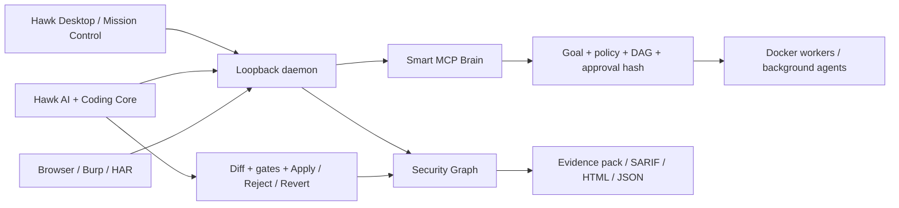

<h1 align="center">Hawk Security IDE</h1>

<p align="center">
  
</p>

<p align="center"><strong>Map the risk. Prove the fix.</strong><br />
The local-first security IDE for code, runtime evidence, governed AI, and reviewable change.</p>

<p align="center">
  <a href="https://github.com/MrBoodj011/hawk/actions"></a>
  <a href="https://github.com/MrBoodj011/hawk/releases"></a>
  <a href="LICENSE"></a>
  <a href="https://github.com/MrBoodj011/hawk"></a>
</p>

<p align="center">
  <a href="#why-hawk">Why Hawk</a> ·
  <a href="#product-surfaces">Product surfaces</a> ·
  <a href="#quick-start">Quick start</a> ·
  <a href="#security-model">Security model</a> ·
  <a href="docs/architecture.md">Architecture</a> ·
  <a href="output/pdf/Hawk_Guide_Complet_Projet.pdf">Complete project guide</a>
</p>


> Hawk is a branded Code-OSS workspace that keeps the operator in control. It connects source code, observed traffic, findings, evidence, AI-generated patches, tests, and retests in one local operating surface.

## Why Hawk

Hawk is built around one auditable loop:

```text
Understand code -> observe authorized traffic -> test a signal -> collect proof -> fix -> test -> retest
```

The product is intentionally local-first and review-controlled:

| Principle | What it means in practice |
| --- | --- |
| **Local by default** | Source, sessions, evidence, credentials, and model configuration stay on the operator machine. |
| **Approval-gated** | Sensitive scans, network access, replays, Docker missions, tests, Apply, and Revert require explicit decisions. |
| **Proof before verdict** | A static signal is not a vulnerability. Identity, impact, scope, side effects, redaction, and evidence gates remain separate. |
| **Recoverable** | Long AI tasks, Docker workers, leases, checkpoints, and orchestration state survive interruption and restart. |
| **Inspectable** | Plans, hashes, tool calls, diffs, test gates, artifacts, and provenance are visible instead of hidden behind a chat box. |

## Product surfaces

### Mission Control

An operational dashboard for source surface, API exposure, live and imported traffic, signals, sandbox proof, posture, the Security Graph, and governed actions.

### Hawk AI

An in-editor engineering room with streaming responses, plans, tool events, task history, file/tab/git/diagnostics context, exact diff preview, checkpoints, Apply / Reject / Revert, test gates, and pause/resume recovery.


### Hawk Coding Core

- Hawk Tab and bounded multiline Next Edit prediction.
- Persistent incremental semantic index with TypeScript/JavaScript AST and language-aware symbols for Python, Java, Kotlin, C#, Go, and Rust.
- Optional loopback-only Ollama embeddings and lexical fallback.
- Model router with local Ollama, LM Studio, and explicit BYOK providers.
- Debug Agent for DAP snapshots and bounded diagnose -> edit -> approved test -> fix loops.
- AST-aware semantic merge for parallel worktrees.
- Local latency, model-evaluation, and memory benchmarks.

### Security workflow

- Passive route indexing for Express, Fastify, and common Next.js API layouts.
- Passive rules for embedded credentials, disabled TLS verification, `eval`, interpolated SQL-looking calls, and risky CORS combinations.
- Deterministic offline reproduction in Docker with baseline, negative-control, and reproduction gates.
- Findings triage with source navigation, reproduction, retest, evidence packs, and proof history.
- Security Graph linking repositories, files, symbols, routes, requests, identities, findings, patches, tests, runs, and artifacts.

### Browser and Burp companions

Capture is disabled by default and stays bounded by pairing, URL scope, request rate, redaction, and queue limits.


Governed identity replay is available for an explicitly approved captured request:

- exact host-and-port binding;
- 2-8 named credential sets;
- 0.1-5 requests per second;
- no redirects;
- bounded request and response fingerprints;
- credentials and bodies held in memory only;
- response differences are leads for review, never automatic authorization findings.

### The operating surface

<p align="center">
  
  
</p>

<p align="center"><sub>Security Graph correlation on the left. Review-gated AI change control on the right.</sub></p>

### Smart MCP Brain

Hawk includes a typed MCP control plane for goals, scope, capability discovery, policies, DAG plans, model routing, approvals, durable runs, worker leases, memory, Sentinel checks, structured artifacts, and native MCP Tasks.

The MCP App is sandboxed and zero-egress by default. The MCP server exposes local resources, prompts, typed tools, risk annotations, and live event notifications without turning the IDE into an unbounded agent shell.

### Distributed Docker workers

Long jobs can fan out across up to 32 bounded worker instances with dependency-aware scheduling, critical-path scoring, leases, retry reassignment, resource governance, checkpoints, and restart recovery.

| Network mode | Guardrail |
| --- | --- |
| `none` | Default. No worker network. |
| `restricted` | Authenticated Hawk egress proxy with exact host and port allowlists. |
| `bridge` | Compatibility mode; use only with explicit approved external access. |

## Architecture at a glance



The daemon binds to loopback and requires a random process-scoped token. The extension, MCP bridge, and companions use separate short-lived credentials and explicit pairing.

## Quick start

### Requirements

- Node.js 20+ and npm.
- Git.
- Docker Desktop for sandbox reproduction or worker orchestration.
- Optional: Ollama for private local models.
- Optional: Java 21 for the Burp companion.

### Build the workspace and extension

```sh
npm install
npm run build
npm run check:extension
npm run build:extension
```

Open `extensions/hawk-security-ide` in a Code-OSS extension development host, then open the Hawk activity-bar icon. `Ctrl+Shift+H` opens Mission Control and `Alt+\\` requests Hawk Tab / Next Edit.

### Start the local daemon

```sh
npm run dev:ide-daemon -- --workspace /path/to/project
```

The command prints a loopback URL and process-scoped token:

```sh
curl -H "X-Hawk-Token: <token>" http://127.0.0.1:<port>/v1/health
curl -X POST -H "X-Hawk-Token: <token>" http://127.0.0.1:<port>/v1/workspace/index
```

### Optional local AI

Use **Hawk: Set Up Local AI with Ollama** from the command palette. The wizard verifies the official installer digest and Windows signer, recommends a model for available RAM, asks for approval before download, and configures the loopback provider.

### Build the restricted egress proxy

```sh
npm run docker:build-egress-proxy
```

The proxy is used only by workers whose plan explicitly selects `network_mode: restricted` and supplies an allowlist.

### Start the MCP server

The **Copy MCP config** command copies a local-only configuration:

```json
{
  "mcpServers": {
    "hawk": {
      "command": "hawk-ide-mcp",
      "args": ["--workspace", "${workspaceFolder}"]
    }
  }
}
```

## A typical Hawk run

1. Open a trusted workspace and index the source surface.
2. Ask Hawk AI to investigate a route, failure, or security hypothesis.
3. Select file, tab, git diff, diagnostics, traffic, and semantic-index context.
4. Review the plan, tool events, streamed answer, and exact diff.
5. Run only the approved typecheck, lint, test, or build gates.
6. Apply the hash-bound patch, reject it, or preserve it as a checkpoint.
7. Pair Browser/Burp or import a redacted HAR when runtime context is needed.
8. Reproduce supported deterministic signals in an offline sandbox.
9. Use the Security Graph and evidence builder to produce a portable report.
10. Retest the signal after the fix; keep the finding unverified until all gates pass.

## Security model

Hawk is a security tool, so its own actions are constrained:

- **Workspace boundary:** file tools are bounded to the selected workspace or isolated worktree.
- **Network boundary:** no-network Docker is the default; restricted egress uses an authenticated exact allowlist.
- **Credential boundary:** provider keys, pairing tokens, and replay credentials never enter the UI history or reports.
- **Patch boundary:** Apply and Revert verify preimage/postimage hashes and refuse drift.
- **Evidence boundary:** bodies, cookies, credentials, debugger values, and secret-shaped strings are redacted or capped.
- **Agent boundary:** model output can propose a change, but cannot silently apply it to the real workspace.
- **MCP boundary:** Sentinel fingerprints manifests and detects poisoning, injection, secret-like results, allowlist violations, and post-trust changes.

Read the [threat model](docs/security/THREAT_MODEL.md), [Security Policy](SECURITY.md), and [Responsible Use Policy](RESPONSIBLE_USE.md) before using active validation features. Use Hawk only against projects and targets you are authorized to test.

## Validation snapshot

The latest local validation snapshot for commit `ddf4c51`:

| Check | Result |
| --- | --- |
| Test files | 95 |
| Tests passed | 745 |
| Tests skipped | 16 |
| Chaos scenarios | 4/4 |
| TypeScript / Biome / tsup build | PASS |
| Index benchmark | PASS, peak RSS below 500 MiB |
| Production dependency audit | 0 vulnerabilities |
| Branding guard | PASS across the working tree |

Run the full local gate with:

```sh
npm run ci
npm run test:chaos
npm run benchmark:index-memory
npm audit --omit=dev
```

## Release readiness

The code and local release workflow are present. These owner-controlled production gates remain external:

- Windows code-signing certificate and publisher pin.
- GitHub Actions billing/spending-limit repair.
- Official signed v0.7.0 GitHub Release.
- Real beta sessions on larger projects.
- Independent external security assessment.
- Chrome Web Store and PortSwigger BApp Store accounts/review.

Hawk is intentionally a personal, local-first product: no Hawk account, team/RBAC system, Stripe billing, cloud synchronization, telemetry collector, Apple build, or hosted Hawk backend is required.

## Documentation map

- [Complete project guide PDF](output/pdf/Hawk_Guide_Complet_Projet.pdf)
- [Product architecture](docs/architecture.md)
- [Native Hawk AI](docs/native-ai.md)
- [Smart MCP Brain](docs/smart-mcp.md)
- [Parallel Docker orchestration](docs/parallel-orchestration.md)
- [Sandbox reproduction](docs/sandbox-reproduction.md)
- [Identity replay](docs/traffic-identity-replay.md)
- [Production readiness](docs/release/PRODUCTION_READINESS.md)
- [External pentest runbook](docs/audit/EXTERNAL_PENTEST_RUNBOOK.md)
- [Threat model](docs/security/THREAT_MODEL.md)

## Health report liaison

Hawk can import a sanitized `health.json` produced by the separate [Cybrense Hawk](https://github.com/Cybrense-IT-Services/Hawk) project. This is a file-contract integration only. Hawk stores only a sanitized local summary and never accepts an App private key, installation token, raw alert payload, source code, or pull-request body.

## License

Hawk is distributed under [Apache-2.0](LICENSE). Required third-party attributions are kept in [NOTICE](NOTICE).
